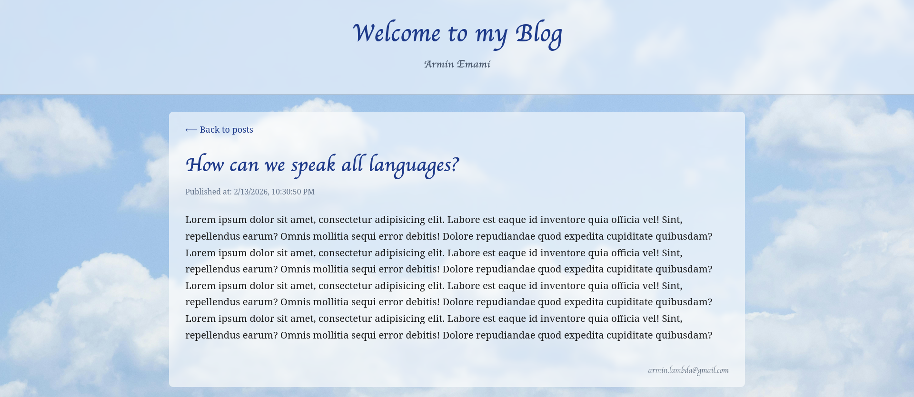

## Django & React Blog

## Setup project
### FrontEnd
#### Navigate to the frontend folder.
    npm install

    npm start

### Backend
#### Navigate to the backend folder.
    pip install -r requirements.txt
    
    python manage.py migrate

    python manage.py runserver

### You should use the Django admin panel to manage Blog (with your superuser `username` and `password`).
#### Navigate to the backend folder.
    python manage.py createsuperuser

